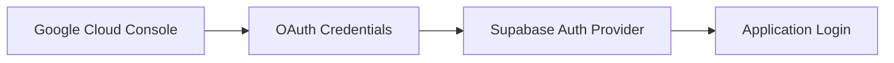
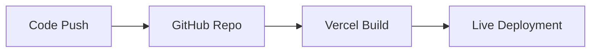

# 🚀 Travolish

<p align="center">
  <a href="https://travolish-ten.vercel.app/">
    
  </a>
  
  
  
  
</p>

---

## 🌐 Live Application

🔗 **Production URL:**
👉 https://travolish-ten.vercel.app/

This web app is rendered inside the **React Native app** using a WebView.

---

## 🔐 Credentials (Development Use)

> ⚠️ Use only for development/testing purposes

* **Email:** `travolish.dev@gmail.com`
* **Password:** `Travolish@123`

Used across:

* Supabase
* Firebase Console
* Google Cloud Console
* GitHub (for deployment)

---

## 🔑 Google OAuth Setup

### Configuration Flow



### Steps

1. Create OAuth credentials in **Google Cloud Console**
2. Add credentials to **Supabase → Authentication → Providers → Google**
3. Configure **Redirect URLs** in both:

   * Google OAuth settings
   * Supabase Auth settings

> ⚠️ Make sure redirect URLs match exactly to avoid auth failures

---

## 🚀 Deployment (Vercel)

### 🔄 Auto Deployment

* Connected via **GitHub**
* Every push to `main` branch triggers deployment automatically



---

## 📱 Mobile App Setup (Expo)

### 1️⃣ Install Dependencies

```bash
npm install
```

### 2️⃣ Start Development Server

```bash
npx expo start
```

### 3️⃣ Run on Device

* Press `a` → Android
* Press `i` → iOS

---

## 🏗️ Build APK (Android)

### Install EAS CLI

```bash
npm install -g eas-cli
```

### Run Build

```bash
eas build --platform android --local
```

---

## 🧱 Tech Stack

| Category     | Technology            |
| ------------ | --------------------- |
| Frontend     | React Native (Expo)   |
| Web App      | React (Vercel Hosted) |
| Backend/Auth | Supabase              |
| Additional   | Firebase              |
| Deployment   | Vercel                |
| CI/CD        | GitHub Integration    |

---

## 🧩 Architecture Overview

```mermaid
flowchart TD
A[React Native App] --> B[WebView]
B --> C[Hosted Web App (Vercel)]
C --> D[Supabase Auth]
C --> E[Firebase Services]
```

---

## 📌 Important Notes

* ✅ Ensure OAuth redirect URLs are correctly configured
* ✅ Supabase Google provider must match Google Console credentials
* ✅ Deployment is automatic via GitHub → Vercel
* ⚠️ Do not expose credentials in production

---

## 🤝 Contributing

1. Fork the repo
2. Create a feature branch
3. Push changes
4. Open a Pull Request

---

## 📄 License

This project is for internal/development use.

---

<p align="center">
  Made with ❤️ using Expo, Supabase & Vercel
</p>
